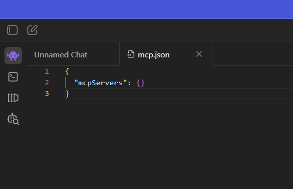
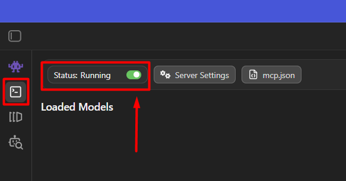
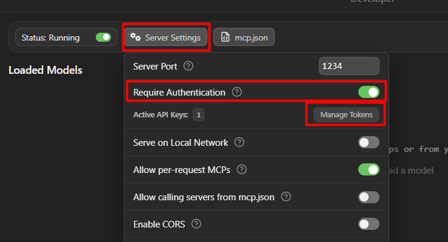
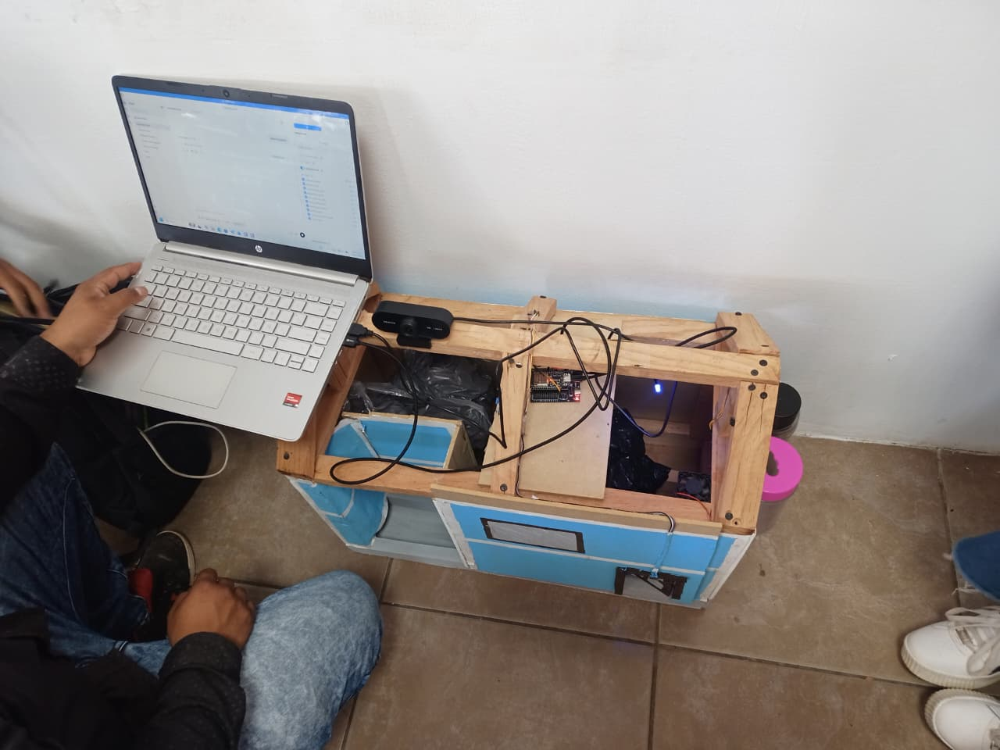

# Casa automatizada V2

La versión anterior requeria que el usuario tuviera que usar la interfaz de LMStudio para poder especificarle al modelo que herramientas utilizar, pero requeria continua interacción con el modelo a través del chat por lo que no era completamente automatizado.

https://github.com/Miguel-Pasc/CasaAutomatizada

Consiste en el uso de LLM en conjunto de un servidor MCP y un ESP32 o un Arduino para controlar el funcionamiento de sensores y actuadores de una casa (a escala) haciendo uso de lenguaje natural a traves de una interfaz conocida (un chat interactivo como el de ChatGPT).

La nueva versión, no requiere que el usuario interactúe con el modelo, ya que se hace uso de un script que se ejecuta cíclicamente conectandose con el servidor local de LMStudio y el servidor MCP para poder utilizar tanto el modelo como las herramientas del proyecto, a través de requests.

Unicamente se creó un nuevo script y se hicieron ligeras modificaciones en el script del servidor MCP para que pudiese funcionar, el resto del proyecto se conservo como en la versión inicial.

## Características
- Uso de LLM local (seguridad de datos)
- Control sobre sensores y actuadores
- Interacción sencilla con las herramientas

## Requisitos
- LM Studio
- Python 3
- FastMCP
- Arduino IDE
- ESP32

## Instalación
Clonar repositorio
```
git clone https://github.com/mauricionlz2018-tech/CasaAutomatizada.git
```

Crear entorno virtual para instalar librerías
```
python -m venv _nombre_entorno_
```

Activar entorno virtual
```
_nombre_entorno_/Scripts/activate
```


> En caso de que se muestre un error al intentar activar el entorno virtual, ejecute lo siguiente:\
>\
`Set-ExecutionPolicy -Scope Process -ExecutionPolicy Bypass`\
>\
>  Y una vez ejecutado se vuelve a intentar activar el entorno virtual

Al ejecutarse el entorno virtual se instalan las siguentes librerías:
```
pip install fastmcp pyserial requests opencv-python httpx
```

En Arduino IDE se instala la librería necesaria para el ESP32Servo\


Se agrega la placa para el ESP32


Se abre el archivo .ino que se encuentra en la carpeta `source_code` y se carga al ESP32 conectado al computador.

## Uso
Se tiene que tener conectado el ESP2 y una web-cam al computador, en el caso del ESP32 se debe de consultar el puerto COM al que se conecto desde el administrador de dispositivos (se accede a un menú presionando `ctrl + x` y se selecciona la opción de administrador de dispositivos):


Se accede al código del servidor mcp llamado `server2.py` y se tendrán que modificar dos líneas de código:
1. El puerto COM, se coloca el que aparece en el administrador de dispositivos.
2. El modelo, pero este se modifica más adelante.


### Descargar modelo en LM Studio
Para modificar la linea de codigo que contiene el modelo se debe de acceder a LM-STUDIO, y descargar un modelo.
1. Se selecciona en la barra lateral la opcion de buscar modelos.
2. Se escribe en el menu de busqueda algún modelo.
3. Se selecciona el modelo de entre las opciones mostradas, debe de tener un símbolo de un ojo que indica visión y otro de un martillo que indica que puede usar herramientas.
4. En el panel derecho se muestran las especificaciones del modelo asi como la compatibilidad con el equipo de computo, en este caso el modelo es compatible por lo que se presiona en descargar.

El nombre del modelo que se descarga es el que se colocara en la linea de codigo que se especifica, `MODEL_NAME = "mistralai/ministral-3-3b"`.

### Levantar servidor MCP
Una vez modificado el codigo, se va ejecutar el servidor MCP con el siguiente comando en la terminal:
```
fastmcp run server2.py:app --transport=http
```

### Configurar LM Studio
En el apartado de `chat` (icono de personaje morado en la parte izquierda superior), del lado derecho, se dara clic en el icono del `martillo`, se selecciona `install` y se elige `editar mcp.json`.

Se mostrara un archivo .json, el cual contendra lo siguiente:



En el apartado de `Developer` se tendra que encender el servidor local del LLM Studio para poder comunicarse correctamente con el servidor:



Y se tendra que seleccionar `Server Settings` para configurar una API Key que servira como autenticación.



Se tendra que cargar el modelo que se descargo, seleccionando la opcion de `load a model to load` de la parte superior:


### Ejecución del Script para la automatización
Para ejecutar el script se utiliza el siguiente comando 

```
python agente_lmstudio1.py
```

Y automaticamente comenzara a realizar el procedimiento para poder utilizar el modelo y las herramientas, la casa automatica estará en funcionamiento, el modelo analizará la distancia del sensor ultrasonico, si es menor a 50 cm, tomará una foto, la analizará y determinará que hacer.

En este caso, al detectar una persona, abre la puerta y enciende la led, para después de 4 segundos apagar la led y cerrar la puerta (simulando que la persona ingresó a la casa).


